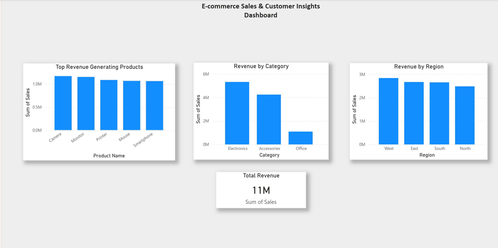

📊 Customer Behavior & Revenue Analysis Dashboard
📌 Objective
To analyze customer behavior and revenue patterns in an e-commerce dataset and generate actionable business insights.

 📊 Dashboard Preview

🧾 Dataset Overview
The dataset contains transaction-level data including:

- Order Date  
- Product Name  
- Category  
- Region  
- Quantity  
- Sales  
- Profit  

🔍 Analysis Performed

 1. Repeat Purchase Behavior
- Identified frequently purchased product-region combinations  
- Analyzed patterns indicating customer preference  

 2. Purchase Frequency
- Measured total quantity sold per product  
- Identified high-demand items  

 3. Revenue Analysis
- Top revenue-generating products  
- Revenue contribution by category  
- Regional sales performance  

 📈 Key Insights

- High-demand products do not always generate the highest revenue  
- A small group of products contributes significantly to total revenue  
- Certain product-region combinations show strong repeat purchase patterns  
- Revenue varies significantly across categories and regions  
- West region shows strong sales performance  

💡 Business Recommendations

- Focus on high-revenue products to maximize profitability  
- Optimize pricing for high-demand but low-revenue items  
- Expand operations in high-performing regions  
- Improve inventory planning based on demand patterns  
- Use repeat purchase trends for targeted marketing  

 🛠️ Tools & Technologies

- Python (Pandas, Matplotlib)  
- Power BI  
- Jupyter Notebook  

📁 Project Structure
ecommerce-customer-behavior-analysis/
│
├── data/
│ └── sample_data.csv
│
├── notebooks/
│ └── ecommerce.ipynb
│
├── images/
│ └── dashboard.png
│
├── README.md
└── final_report.md

🚀 Conclusion

This project demonstrates how raw e-commerce data can be transformed into meaningful insights that support data-driven decision-making.

 ⚠️ Note
The original dataset was large, so a sample dataset is included for analysis and reproducibility.

